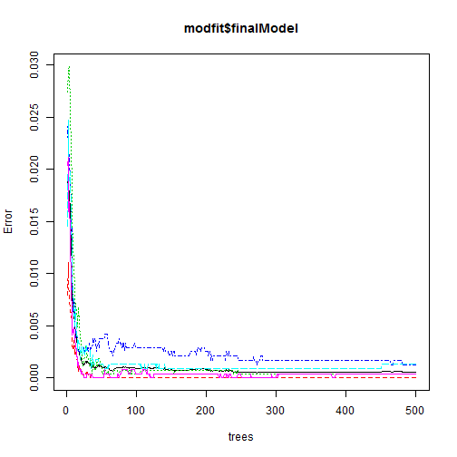

## Summary
This article contains prediction analysis conducted on activity monitoring to correctly predict activities being done based on measurement data. After some data processing, a number of features are selected and used to fit the provided data using random forest algorithm. Both the training and cross-validation has very high accuracy greater than 99.9% and the model gives perfect prediction on test data. This shows thet the devloped model can succesfully predict the type of activities being done with very high accuracy. 

## Introduction

This report contains the analysis of activity monitoring data obtained from wearable devices. The data is obtained from <https://d396qusza40orc.cloudfront.net/predmachlearn>. The task is to develop a model to predict accurately if someone lifts dumbbell correctly based on sensor data placed on the belt, arm, forearm of teh subject and also on the dumbbell itself. 

Before processing the data we will first include the R packages required for our analysis, set the working directory and read in the data of interest.


```r
require(stats)
require(caret)
setwd("~/Documents/R_Programming/PML")
training <- read.csv("pml-training.csv")
testing <- read.csv("pml-testing.csv")
```

## Exploratory data analysis

Before embarking on prediction modeling, we will conduct  basic exploratory data analysis.

We can take the summary and check the dimension of both the training and testing data sets


```r
dim(training)
```

```
## [1] 19622   160
```

```r
dim(testing)
```

```
## [1]  20 160
```

Both training and testing data sets consiste of 160 variables many of which contains NA. To decide wether to impute the NAs or not, it's importantto find the percentage of the total data set that's NA.


```r
mean(is.na(testing))
```

```
## [1] 0.625
```

```r
mean(is.na(training))
```

```
## [1] 0.4100856
```
Results shows that approximately 41% and 62.5% of training and testing sets contains NAs respectively. With these large proportion of NAs, it is not recommended to impute as the imputed values might introduce bias into the prediction model. Therefore, it is better to remove variables with only NA values as follows.


```r
pointer <- !is.na(testing)
nonaCount <- apply(pointer,2, sum)
nonaset <- nonaCount[nonaCount > 0]
nonaVar <- names(nonaset)
test <- testing[,nonaVar]
train0 <- training[,c(nonaVar[1:59], "classe")]
```
We can see that there are about 100 variables with only NA values which should not be included in our machine learning prediction. Having removed the variable with all NA values, the percentage NAs is now zero.

```r
mean(is.na(test))
```

```
## [1] 0
```

```r
mean(is.na(train0))
```

```
## [1] 0
```
## Regression Modeling

Since our test data set does not contain the outcome variable it's important to have a cross validation set  to be able to evaluate the out of sample error of the model. Here we will partition the trimmed training data set `train0` into training and cross validation data sets. 


```r
set.seed(1234)
inTrain <- createDataPartition(train0$classe, p =0.7, list = F)
training0 <- train0[inTrain,]
cval0 <- train0[-inTrain,]
```
We will proceed to fit our model using the training set `training0` and then measure the out of sample error on the cross validation set `cval0`. It's important that we choose a model and set of feature that give very small or no training and crossvalidation error. In fact, for use to rely on the model fit, teh cross-validation has to be very close to the training error. Here we will fit the model using random forest algorithm. The choise of random forest algorithm (or any other tree based algorithm) is to be able to accurately fit the non-linearity between the outcomes and the regressors as can be seen in some pair plots of the variables.

Before performing model fitting on the training set, we first check the features and select as few number of features as will give accurate predictions.

The 59 variable can be grouped into 5 categories:

* Information variables (1-7)
* Belt measurement Variables (8-20)
* Arm measurement variables (21-33)
* Dumbbell measurement varables (34-46)
* Forearm measurement variables (47-59)

Each measurement variables contains 13 measurement type namely: roll, pirch, yaw, total accel, accel-x, accel-y, accel-z, gyro-x, gyro-y, gyro-z, magnet-x, magnet-y, magnet-z.
We will make a pair plot according to the information categories to see if there are any redunndant or confounding variable tat should not be included in the model fit.

```r
pairs(train0[,c(1:7,60)], main = "Information variables, 1-7 and classe")
```

 

```r
pairs(train0[,c(8:20,60)], main = "Belt measurement variable, 8-20 and classe")
```

 

```r
pairs(train0[,c(21:33,60)], main = "Arm measurement variable, 8-20 and classe")
```

 

```r
pairs(train0[,c(34:46,60)], main = "Dumbbell measurement variable, 8-20 and classe")
```

 

```r
pairs(train0[,c(47:60)], main = "Forearm measurement variable, 8-20 and classe")
```

 

As can be seeen on all the plots, it is difficult to identfy the linear depencies within each of the catergories. However, the pairs plot shows that variable X which denotes the serial number of the observations has a linear factor relationship with the outcome "classe" and therefore can introduces unwarranted bias into the model. Therefore, the variable is removed and remaining 57 regressors are used to fit the model. 


```r
modfit <- train(classe ~.-X, data = training0, method = "rf")
```

```
FALSE Warning: package 'randomForest' was built under R version 3.1.3
```

Belwo is the summary of the the fitted model.

```r
modfit$finalModel
```

```
## 
## Call:
##  randomForest(x = x, y = y, mtry = param$mtry) 
##                Type of random forest: classification
##                      Number of trees: 500
## No. of variables tried at each split: 41
## 
##         OOB estimate of  error rate: 0.06%
## Confusion matrix:
##      A    B    C    D    E  class.error
## A 3906    0    0    0    0 0.0000000000
## B    0 2657    1    0    0 0.0003762227
## C    0    3 2393    0    0 0.0012520868
## D    0    0    2 2249    1 0.0013321492
## E    0    0    0    1 2524 0.0003960396
```

The final model is plotted below:

```r
plot(modfit$finalModel)
```

 

The in-sample error can be calculated using the confussion matrix as shown below

```r
confusionMatrix(train0$classe, predict(modfit,train0))
```

```
## Confusion Matrix and Statistics
## 
##           Reference
## Prediction    A    B    C    D    E
##          A 5580    0    0    0    0
##          B    1 3796    0    0    0
##          C    0    1 3421    0    0
##          D    0    0    1 3215    0
##          E    0    0    0    1 3606
## 
## Overall Statistics
##                                           
##                Accuracy : 0.9998          
##                  95% CI : (0.9995, 0.9999)
##     No Information Rate : 0.2844          
##     P-Value [Acc > NIR] : < 2.2e-16       
##                                           
##                   Kappa : 0.9997          
##  Mcnemar's Test P-Value : NA              
## 
## Statistics by Class:
## 
##                      Class: A Class: B Class: C Class: D Class: E
## Sensitivity            0.9998   0.9997   0.9997   0.9997   1.0000
## Specificity            1.0000   0.9999   0.9999   0.9999   0.9999
## Pos Pred Value         1.0000   0.9997   0.9997   0.9997   0.9997
## Neg Pred Value         0.9999   0.9999   0.9999   0.9999   1.0000
## Prevalence             0.2844   0.1935   0.1744   0.1639   0.1838
## Detection Rate         0.2844   0.1935   0.1743   0.1638   0.1838
## Detection Prevalence   0.2844   0.1935   0.1744   0.1639   0.1838
## Balanced Accuracy      0.9999   0.9998   0.9998   0.9998   1.0000
```
The training accuracy as shown above is 99.98%, i.e. training error of 0.02%. Therefore we expect the cross-validation accuracy to be around the same i.e. out of sample error in the neighborhood of 0.01%.

Using the obtained model, we can easily calculate the cross validation error using confusion matrix.

```r
confusionMatrix(cval0$classe, predict(modfit,cval0))
```

```
## Confusion Matrix and Statistics
## 
##           Reference
## Prediction    A    B    C    D    E
##          A 1674    0    0    0    0
##          B    1 1138    0    0    0
##          C    0    1 1025    0    0
##          D    0    0    1  963    0
##          E    0    0    0    1 1081
## 
## Overall Statistics
##                                           
##                Accuracy : 0.9993          
##                  95% CI : (0.9983, 0.9998)
##     No Information Rate : 0.2846          
##     P-Value [Acc > NIR] : < 2.2e-16       
##                                           
##                   Kappa : 0.9991          
##  Mcnemar's Test P-Value : NA              
## 
## Statistics by Class:
## 
##                      Class: A Class: B Class: C Class: D Class: E
## Sensitivity            0.9994   0.9991   0.9990   0.9990   1.0000
## Specificity            1.0000   0.9998   0.9998   0.9998   0.9998
## Pos Pred Value         1.0000   0.9991   0.9990   0.9990   0.9991
## Neg Pred Value         0.9998   0.9998   0.9998   0.9998   1.0000
## Prevalence             0.2846   0.1935   0.1743   0.1638   0.1837
## Detection Rate         0.2845   0.1934   0.1742   0.1636   0.1837
## Detection Prevalence   0.2845   0.1935   0.1743   0.1638   0.1839
## Balanced Accuracy      0.9997   0.9995   0.9994   0.9994   0.9999
```
Just as expected the cross-validation error is approximately 0.05%. We can see that both the in sample and out of sample standard errors are very low which shows good selection of regressors and training method.

Finally, we can used the fitted model to make prediction on test data as shown below

```r
prediction <- predict(modfit,test)
print(prediction)
```

```
##  [1] B A B A A E D B A A B C B A E E A B B B
## Levels: A B C D E
```

## Conclusion
he high cross validation accuracy shows that appropriate number and type of features were selected. Also, it shows that random forest algorithm is a good model fit method for this problem. 

Finally, the results from the test data set are converted into text files and uploaded.

```r
pml_write_files(prediction)
```
It's worth mentioning the prediction accuracy based on the test data set is 100% which futher attest to the accuracy of the training method and proper feature selection. Please not that had we included variable X in the analysis, the prediction gives all "A" predictions to tha test data which validates that X should not included in the predction modelling.
